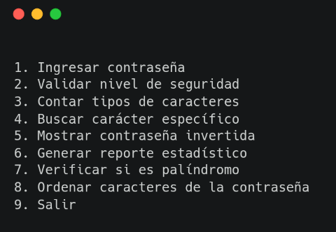

# Primer Parcial de Programacion 1
### Ivan Caceres
#### Div 316, Turno Noche
##
## Objetivo:
### Desarrolar un programa que permita analizar y validar contraseñas ingresadas por usuarios.
### El sistema debera trabajar principalmente con:
- Cadenas de caracteres
- Estructuras condicionales
- Estructuras repetitivas
- Funciones
- Validaciones
##
### Interfaz del Programa: 

### Menú de opciones 

#### El programa deberá mostrar el siguiente menú: 

##

## Funcionalidades: 

### Permitir ingresar una contraseña. 

### Validaciones obligatorias: 

#### La contraseña: 

- No puede estar vacía.
- Debe tener al menos 8 caracteres.  
- No puede comenzar con espacios.  
- Debe contener al menos una letra. 
##

### Validar nivel de seguridad 

### El programa deberá indicar si la contraseña es: 

- Débil  
- Media  
- Fuerte  

### Criterios sugeridos 

- Débil 
    - entre 8 y 9 caracteres 

    - solo letras 
- Media 
    - tiene letras y números.  
- Fuerte 
    - letras  
    - números
    - Símbolos, alguno de los siguientes ! “ # $ % & ‘( ) * + , - . /  
    - al menos 12 caracteres.  

### La validación deberá realizarse recorriendo manualmente la cadena. 
##
### Contar tipos de caracteres 

#### Mostrar: 

- cantidad de letras.  
- cantidad de números.  
- cantidad de símbolos.  
- cantidad de espacios. 

### No se permite utilizar métodos de strings. 
##
### Buscar carácter específico 

### Solicitar un carácter y mostrar: 

- cuántas veces aparece.  
- posiciones en las que aparece. 

### La búsqueda deberá implementarse manualmente. 
##
 

### Mostrar contraseña invertida 

- No se permite utilizar funciones avanzadas ni slicing. 
##

### Generar reporte estadístico 

### Mostrar: 

- longitud total.  
- porcentaje de letras.  
- porcentaje de números.  
- porcentaje de símbolos.  
- cantidad de caracteres repetidos consecutivos. Por ejemplo: aaBB22!! --> Ejemplo: 
   - 1 repetición de a. 
   - 1 repetición de B. 
   - 1 repetición de 2. 
   - 1 repetición de !. 
##
### Verificar si es palíndromo 

#### Determinar si la contraseña se lee igual de izquierda a derecha y de derecha a izquierda.
##
### Ordenar caracteres de la contraseña 

#### Permitir ordenar los caracteres de la contraseña utilizando un algoritmo de ordenamiento implementado manualmente. 

#### El usuario deberá poder elegir: 

- Orden ascendente 
- Orden descendente 

### El ordenamiento deberá realizarse utilizando el código ASCII de los caracteres. 

 Ejemplo: 

 Contraseña: 

- cB3#a 

Ascendente: 
- #3Bac

Descendente: 
- caB3# 
##
### Restricciones específicas  

### No se permite utilizar: 
- sorted() 
- .sort() 
- funciones integradas de ordenamiento 

### El algoritmo deberá implementarse manualmente utilizando estructuras repetitivas y comparaciones. 

### Se recomienda utilizar: 
- Bubble Sort. 
- Selection Sort. 
- Insertion Sort.
##
## Requisitos Técnicos 

### Modularización 

### El programa deberá estar correctamente modularizado. 

### Se evaluará especialmente: 

- reutilización de funciones 

- separación de responsabilidades. 

- claridad algorítmica. 

- descomposición del problema. 
##
### Funciones 

### Se deberán implementar funciones para: 

- validaciones. 
- búsquedas. 
- conteos.
- cálculos
- generación de estadísticas. 
##
### Documentación 

### Todas las funciones deberán incluir: 

- docstrings. 
- sugerencia de tipos (type hints). 
##
## Restricciones 

### NO se permite utilizar: 

- métodos de cadenas. 
- métodos de listas.
- Listas por comprensión. 
- operador in.
- funciones avanzadas del lenguaje. 

### SÍ se permite utilizar: 
- len() 
- int() 
- float() 
- str() 
- range() 
- Y todo lo que hayamos visto hasta el momento de la cursada. 
##
## Requisitos de desarrollo 

- El programa debe ejecutarse sin errores. 

- Debe utilizar funciones correctamente. 

- Debe evitar código duplicado. 

- Debe respetar reglas de estilo vistas en clase. 

- Las validaciones deben resolverse mediante funciones. 